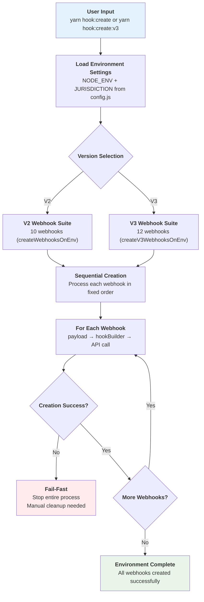
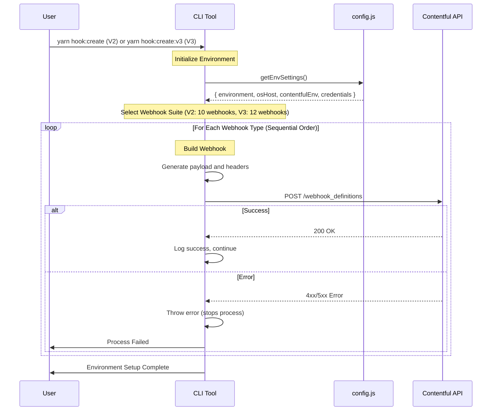

# Webhook Create Workflow

This document describes the workflow for creating webhooks in the contentful-hooks CLI tool.

## Overview

The create process follows a bulk creation pattern that systematically creates all webhooks for a specific environment. Unlike the update process, it creates the complete webhook ecosystem for an environment in a single operation.

## Process Flow



## API Communication Flow



## Key Features

### 🏗️ Bulk Environment Setup
- Creates complete webhook ecosystem for an environment
- No incremental or selective creation - all webhooks at once
- Separate V2 and V3 webhook suites

### 📋 Predefined Webhook Order
- Fixed sequence ensures proper dependency handling
- Clear logging for each webhook creation step
- Logical grouping (update webhooks → delete webhooks)

### 🔧 Consistent Payload Construction
- Uses same payload functions as update logic
- Environment-driven configuration
- Standardized header generation including idempotency keys

### ⚡ Fail-Fast Error Handling
- If any webhook creation fails, entire process stops
- Throws error immediately - no graceful continuation
- Requires manual cleanup of partial environments

### 🎯 Environment-Specific Configuration
- Single source of truth from config.js
- Automatic credential encoding
- Environment-specific URLs and settings

## Webhook Types Created

### V2 Webhooks (10 total)
| Order | Webhook Type | Purpose |
|-------|-------------|---------|
| 1 | Ventures | Venture/brand configuration |
| 2 | Categories | Game categories and classification |
| 3 | Sections | Game sections and layouts |
| 4 | Personalised Sections | ML-driven personalized content |
| 5 | Layouts | Page layouts and mini-games |
| 6 | Games V2 | Game metadata and configuration |
| 7 | SiteGames V2 | Site-specific game settings |
| 8 | Suggested Games | Recommended games logic |
| 9 | General Delete | Delete handler for most content types |
| 10 | Game V2 Delete | Specific delete handler for games |

### V3 Webhooks (12 total)
| Order | Webhook Type | Purpose |
|-------|-------------|---------|
| 1 | Ventures V3 | V3 venture configuration |
| 2 | Navigation | Navigation structure and links |
| 3 | View | View definitions and mini-games |
| 4 | Game Sections | V3 game section management |
| 5 | Marketing Sections | Marketing and promotional content |
| 6 | ML Sections | Machine learning sections |
| 7 | ML Defaults | ML default configurations |
| 8 | Games V3 | V3 game metadata |
| 9 | Site Games V3 | V3 site-specific game settings |
| 10 | Themes | UI themes and styling |
| 11 | General Delete V3 | V3 delete handler |
| 12 | Game V2 Delete V3 | V3 game delete handler |

## Usage Examples

```bash
# Create all V2 webhooks for current environment
yarn hook:create

# Create all V3 webhooks for current environment
yarn hook:create:v3

# Direct node execution
node src/index.js create
node src/index.js create-v3
```

## Environment Configuration

The create process relies on environment variables:

```bash
export NODE_ENV=dev
export JURISDICTION=eu
```

Configuration is loaded from `config.js` based on these environment variables.

