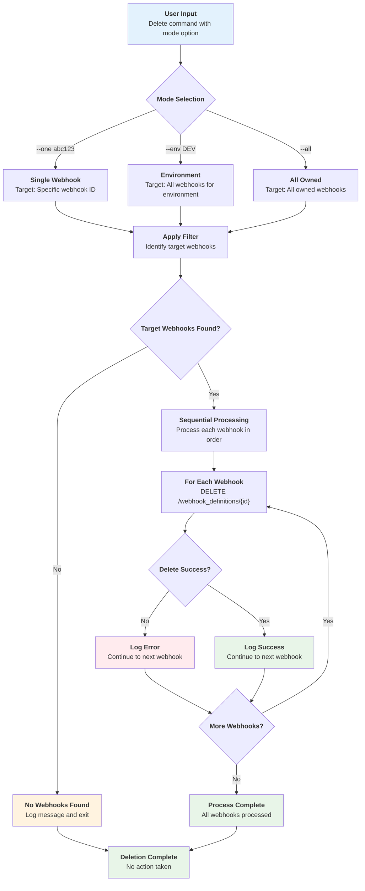
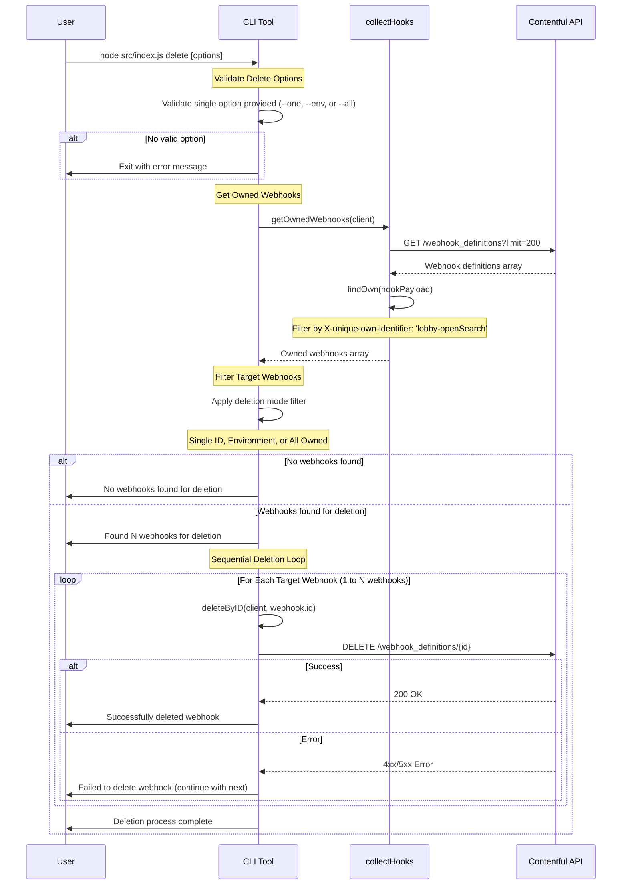

# Webhook Delete Workflow

This document describes the workflow for deleting webhooks in the contentful-hooks CLI tool.

## Overview

The delete process follows a flexible pattern that supports three different deletion options: single webhook deletion, environment-based deletion, and complete cleanup of all owned webhooks.

## Deletion Modes

The delete functionality supports three modes, all following the same basic pattern:



### Mode Characteristics

| Mode | Flag | Target | Use Case |
|------|------|--------|----------|
| **Single** | `--one <id>` | Specific webhook ID | Targeted deletion |
| **Environment** | `--env [ENV]` | All webhooks for environment | Environment cleanup |
| **All Owned** | `--all` | All owned webhooks | Complete cleanup |

## API Communication Flow



## Key Features

### 🔒 Ownership Validation
- Only deletes webhooks with `X-unique-own-identifier: 'lobby-openSearch'`
- Prevents accidental deletion of third-party webhooks
- Automatic filtering during webhook collection

### 🎯 Multiple Deletion Modes
- **Single ID**: Precise deletion for specific webhooks
- **Environment**: Bulk deletion for environment cleanup
- **All Owned**: Complete cleanup of all tool-created webhooks

### 🔄 Sequential Processing
- One webhook at a time for clear audit trails
- Individual error handling prevents cascading failures
- Continues processing even if individual deletions fail

### 📋 Comprehensive Logging
- Clear identification of webhooks being deleted
- Success/failure status for each operation
- Environment-specific filtering results

### 🛡️ Safety Features
- Ownership validation before any deletion
- Graceful handling of missing webhooks
- Non-destructive validation (no accidental deletions)

## Usage Examples

### Command Line Usage

```bash
# Delete a single webhook by ID
yarn delete:one
# or
node src/index.js delete --one abc123

# Delete all webhooks for DEV environment
yarn delete:env:dev
# or
node src/index.js delete --env "[DEV]"

# Delete all owned webhooks
yarn delete:all
# or
node src/index.js delete --all
```

### Package.json Scripts

```json
{
  "scripts": {
    "delete:one": "node src/index.js delete --one <webhook-id>",
    "delete:env:dev": "node src/index.js delete --env '[DEV]'",
    "delete:env:stg": "node src/index.js delete --env '[STG]'",
    "delete:env:prod": "node src/index.js delete --env '[PROD]'",
    "delete:all": "node src/index.js delete --all"
  }
}
```

## Environment Identifiers

The environment-based deletion uses these identifiers:

| Environment | Identifier | Description |
|-------------|-----------|-------------|
| Development | `[DEV]` | Development environment webhooks |
| Staging | `[STG]` | Staging environment webhooks |
| Production | `[PROD]` | Production environment webhooks |
