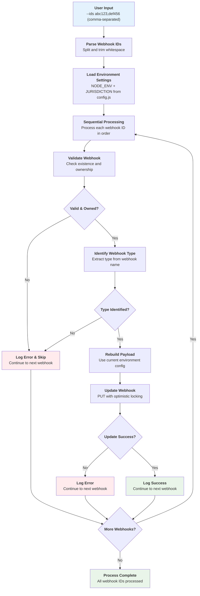
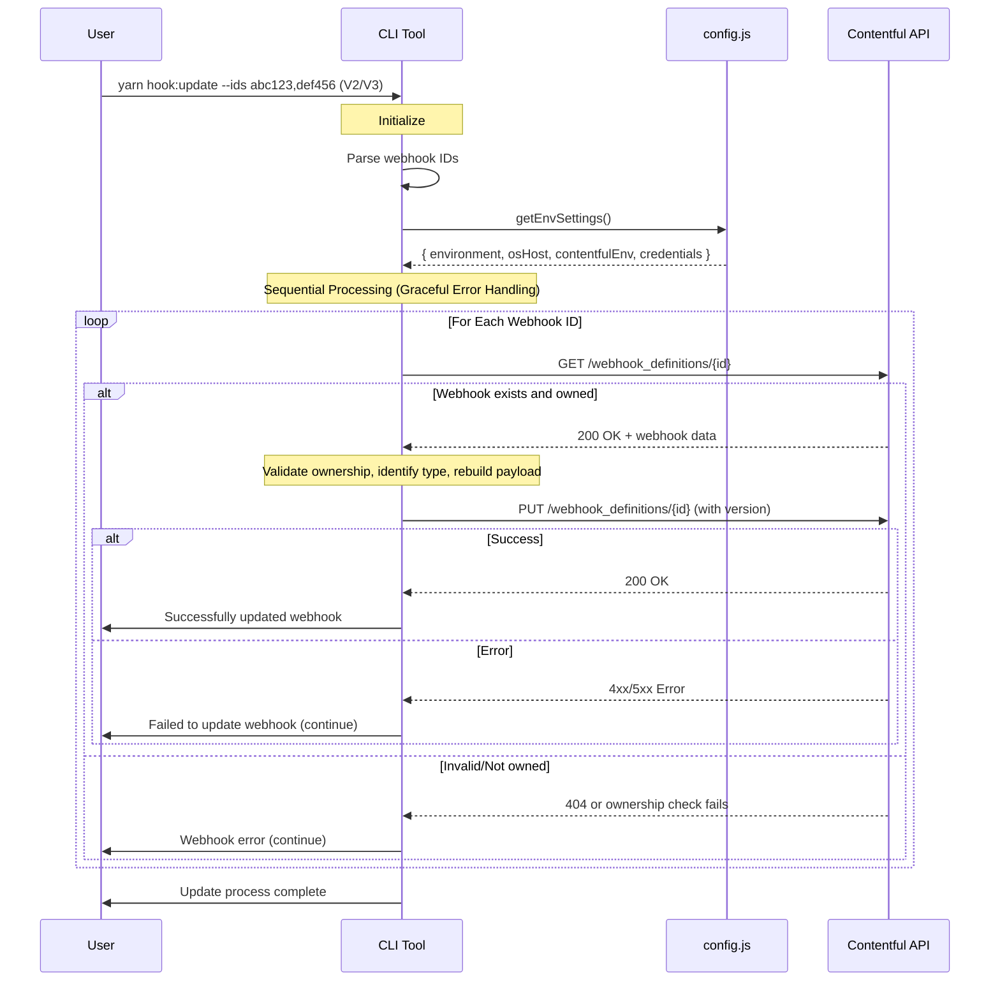

# Webhook Update Workflow

This document describes the workflow for updating webhooks in the contentful-hooks CLI tool.

## Overview

The update process follows a sequential, pattern that validates ownership and rebuilds webhooks using the latest repository configuration.

## Process Flow



## API Communication Flow



## Key Features

### 🔍 Sequential Processing
- Each webhook ID is processed one by one
- No bulk operations - clean error handling per ID

### 🛡️ Multiple Validation Layers
1. **Existence Check**: Does webhook exist in Contentful?
2. **Ownership Check**: Do we own it? (`X-unique-own-identifier: lobby-openSearch`)
3. **Type Identification**: Can we identify the webhook type?
4. **Version Matching**: Does it match target version (V2/V3)?

### ⚙️ Environment-Driven Updates
- Uses repository config as single source of truth
- Fresh payload generation using current environment settings
- No parameter extraction from existing webhooks

### 🎯 Error Handling
- Graceful failures - errors don't stop the entire process
- Clear logging at each decision point
- Continues processing remaining IDs even if some fail

### 🔄 Optimistic Locking
- Uses `X-Contentful-Version` header for safe updates
- Prevents concurrent modification conflicts

## Usage Examples

```bash
# Update V2 webhooks
yarn hook:update --ids abc123,def456

# Update V3 webhooks
yarn hook:update:v3 --ids abc123,def456
```

## Environment Configuration

The update process relies on environment variables:

```bash
export NODE_ENV=dev
export JURISDICTION=eu
```

Configuration is loaded from `config.js` based on these environment variables.

## Error Scenarios

| Error Type | Action | Impact |
|------------|--------|---------|
| Webhook not found | Skip to next ID | Continue processing |
| Not owned by tool | Skip to next ID | Continue processing |
| Cannot identify type | Skip to next ID | Continue processing |
| Version mismatch | Skip to next ID | Continue processing |
| Update fails | Log error, continue | Continue processing |

## Success Criteria

A webhook is successfully updated when:
1. ✅ Webhook exists in Contentful
2. ✅ Tool owns the webhook
3. ✅ Webhook type is identified
4. ✅ Version matches target (V2/V3)
5. ✅ Payload is rebuilt successfully
6. ✅ API update call succeeds 
